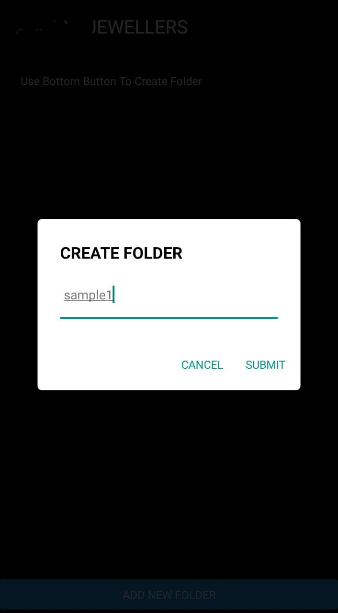
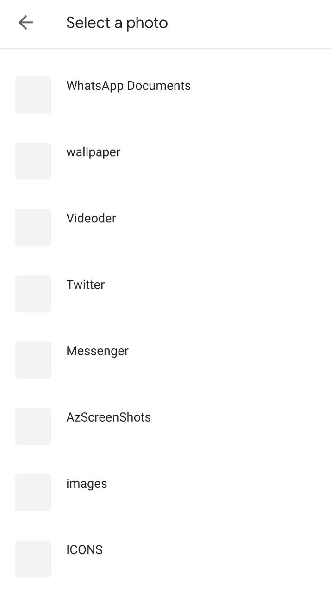

# AdvanceGalleryView_react-native

There's always some photos which we needed on daily basis.
But, When there's a urgent need to show that photo,
we unable to find.
It happen to everyone, every times...

### THUS THIS IS ULTIMATE SOLUTION

Here, you can create you albums, & add photos into them,
No need to worry,
We don't show all photos here, Since we already have some apps, which shows all device photos.
Here we only show photos which are added into our ALBUM

YOU MUST GIVE IT A TRY

SAMPLE PHOTOS:

###### YOU CAN ALSO LEAVES YOUR SUGGESTION
